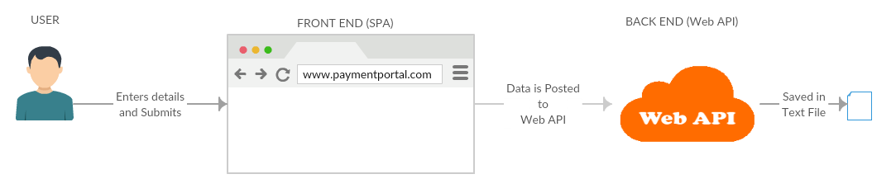

## Payment Portal using AngularJS5 and WebAPI C#

This is a simple application developed using AngularJS5 and C#.

## Table of Contents
 - [Description](#description)
 - [Getting Started](#getting-started)
 - [App Preview](#app-preview) 
 - [Contributors](#contributors) 

## Description

This application has been created to demonstrate SPA (Single Page Application) communicating with Web API.
* Front end is developed using AngularJS 5.
* Back end is developed using C# (Web API - REST)
* Payment details are passed from front end to back end and saved in Text File..

Additionally :
- Code is written in a way that makes it easy to maintain
- Both front end and back end have appropriate unit test coverage
- Key user activities are logged.
- Front end is implemented as an SPA
- Back end is written in C#

## Getting Started

* Clone this repository: `git clone https://github.com/thanveerahamed/Payments_Portal_AngularJS_WebAPI_POC`.
* Want to use TypeScript? Both the `master` branch and the `typescript` branch now use TypeScript.
* Run `npm install` from the project root.
* Run `ng server`.

**Note:** Do not forget to add your name [here](#contibutors) with your contribution.

## App Preview

## Contributors

1. Thanveer Ahamed. (First Commit.)
